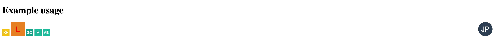

# Letter-avatar

Creates an `svg` letter avatar from text.

## Installation

```
ember install letter-avatar
```

## Usage

One must pass `text` to the component.

`size` defaults to `1024px`

`fontSize` defaults to half of the size

`fontFamily` defaults to `Arial`

`textColor` defaults to `#ffffff`

## Examples

Create a letter avatar and apply a custom size and class.

```
{{letter-avatar text=" J. P." size=48 classNames='circle-right'}}
```

The dummy app has more examples.



### Overrides

One can override the defaults by passing in an attribute of the same name.

```
{{letter-avatar text='kh' fontSize=32}}
```

Resulting html

```
<svg id="ember384" width="1024" height="1024" style="background:#f1c40f" class="ember-view"><text text-anchor="middle" x="50%" y="50%" dy="0.35em" fill="#ffffff" font-size="32" font-family="Arial">KH</text>
</svg>
```

### Inspiration

This is based on [Victor Fernandez gist](https://gist.github.com/vctrfrnndz/fab6f839aaed0de566b0).
